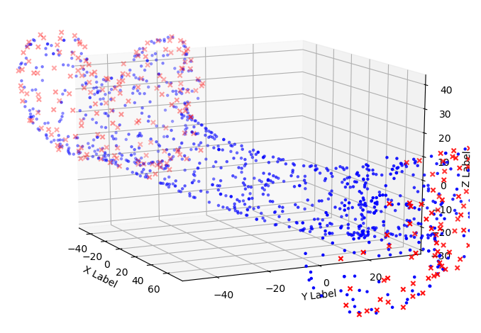

# cas-assignment #
Assignment for the Computer Assisted Surgery course @ University of Bern

# Assignments
## Assignment 1 - Surgical Planning

>Result of the planning assignment [output.txt](assignments/planning/output.txt)

### Report
#### Which morphological operator could you use to separate these two regions? ####
I’d suggest to use an erosion algorithm with a really small structuring element as the two vertebraes are only connected by a single voxel. I choose this algorithm, as it will slightly reduce the image and therefore separates the vertebraes. This, though, might also be a downside as the vertebraes will be slightly smaller after the algorithm has been run. However, I think that’s negligible. 

#### Your CT image has salt & pepper noise. How would you preprocess the image to improve your segmentation? ####
To improve the segmentation on a picture with salt & pepper noise, a median filter might be the best choice. A median filter is better than for example a gauss filter (which could also be used) because it is not affected by spikes. This allows to filter spikes (which salt & pepper clearly is) without making the picture blurry. 

#### You want to plan a trajectory for a pedicle screw placement on your 3D model. What information do you need to define this trajectory? ####
We need the entry point, the target seed and the length from entry to target. Further would be helpful to know what kind of tissue/bone is between entry and target and if there are any nerves/veins on the way. To achieve this, a good segmentation is inevitable as it will highlight the different structures an therefore allows better planning.

#### Which algorithm can you use to get a surface model from your segmentation? ####
To get a surface model of the segmentation, a edge detection algorithm can be used. There are many different ones such as morphological or gradient based ones. The best, however, is the canny edge detection.

#### If you downsample your 3D CT image by a factor of 2 in all dimensions, how much faster or slower will your algorithm get? ####
The easiest to explain would be to visualize this problem with a cube. A cube with a length of 10 would have a volume of 10^3 = 1000. So by cut the length in half, we get a cube with the measurements 5x5x5. The new volume would be 5^3 = 125. Now 125 is only an 8th of 1000. Therefore an algorithm would be 8 times faster by downsampling the picture by the factor of 2. 

## Assignment 2 - Tool Calibration

>Result of the calibration assignment [output.txt](assignments/toolcalibration/output.txt)

### Report

#### In which coordinate system is the vector pt ####
The vector pt is in the marker coordinate system 

#### Write down the formula to get the tip of the pointer in the camera coordinate system ####
pp = pt + Fi

#### Where does the error in your result come from (what you get is not the exact solution which is provided)? ####
Could be from many different things. For example temperature of camera, update rate, sensor calibration, design of rigid body.

#### How many degrees of freedeom can you calibrate with pivoting? Which ones are missing? ####
With pivoting one can calibrate two degrees of freedom. In 3d-space are six possible dof: surge, sway, heave, roll, pitch and yaw. Pivoting only covers roll and yaw. 

**Check**

> Six degrees of freedom - https://en.wikipedia.org/wiki/Six_degrees_of_freedom

DoF | Explanation
--- | ---
Surge | No, the marker can not move forward and backward
Sway | No, the marker can not move right and left
Heave | No, the marker can not move up and down
Roll | Yes, the marker can roll
Pitch | No, the marker can not pitch
Yaw | Yes, the marker can Yaw

#### If your instrument is non-rigid (e.g. a needle) your pt is off if your instrument is bent. How can you overcome this issue? ####
With optical sensors we can measure torsion and flexion of the fibre optic cable and then determine position along the length of the device.

## Assignment 3 - Registration

>Result of the registration assignment [output.txt](assignments/registration/output.txt)

### Report
#### What happens if you use an identity as initial pose? ####

#### Describe two methods, how you can acquire the target data in the OR.####

#### What is the minimum number of points you need for paired points matching? ####

#### If the patient moves, your calculated transformation is not accurate anymore. How can you prevent this? ####

#### We are in ENT surgery now. Which anatomical landmarks do you take for paired points matching and which surface for ICP. Explain why? ####

